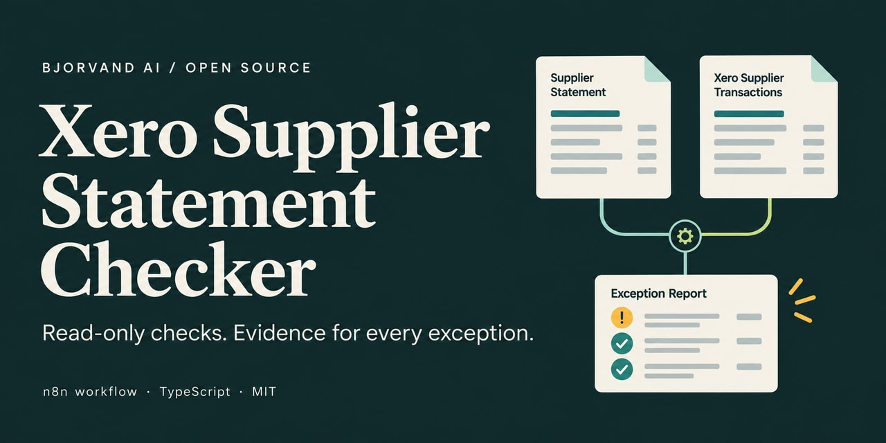
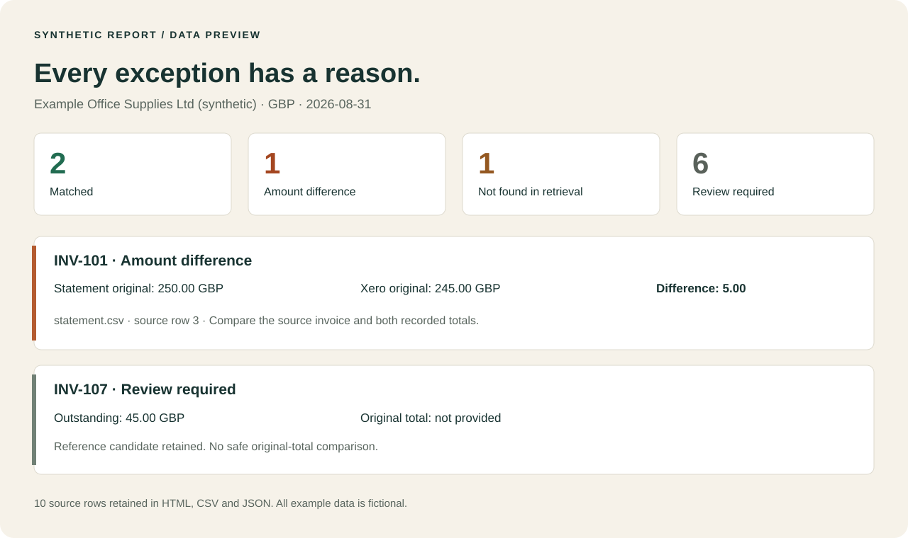
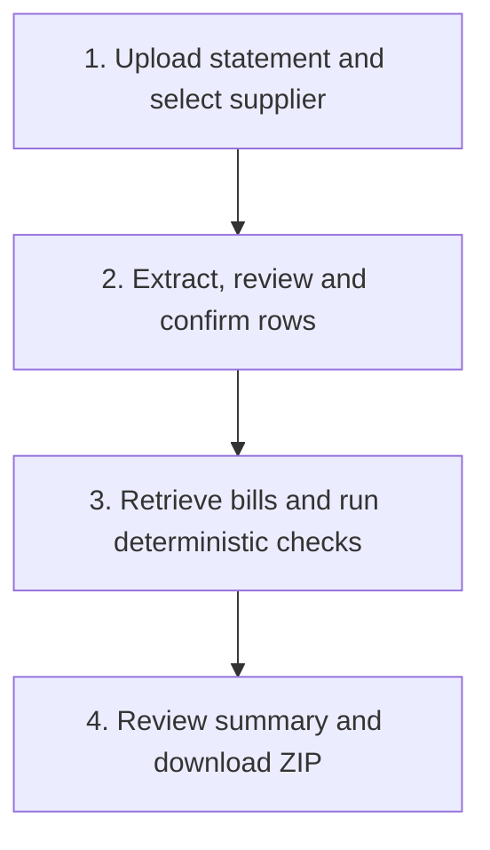

# Xero Supplier Statement Checker — n8n workflow

[](https://github.com/KevinBjorv/xero-supplier-statement-checker/actions/workflows/ci.yml)
[](LICENSE)
[](docs/installation.md)



**Compare supplier statements with Xero purchase bills and review the exceptions.**
This open-source accounts payable workflow accepts CSV or text-based PDF statements,
asks an operator to confirm the rows, then checks invoice references and original
totals. Download an evidence-backed HTML, CSV and JSON report in one ZIP.

Matching is deterministic TypeScript with exact decimal arithmetic. Optional
OpenAI extraction reads PDF fields; the operator reviews them before any matching.
The workflow never posts accounting entries or sends email.

**[Download workflow JSON](https://raw.githubusercontent.com/KevinBjorv/xero-supplier-statement-checker/main/workflows/xero-supplier-statement-checker.json)** ·
**[Download credential-free demo](https://raw.githubusercontent.com/KevinBjorv/xero-supplier-statement-checker/main/workflows/synthetic-demo.json)** ·
**[Installation guide](docs/installation.md)** ·
**[Get this workflow implemented](https://bjorvand.ai/en/workflows/xero-supplier-statement-checker?utm_source=github&utm_medium=readme&utm_campaign=xero_statement_checker#implementation)**

> **Preview — verification in progress.** The downloads above track `main`.
> Local tests and self-hosted n8n checks pass. Live Xero and n8n Cloud verification
> remain pending; the first release is still a draft. See the
> [verification record](docs/verification.md) before processing real statements.

[Example report](#see-the-example-report) · [Quick start](#quick-start) ·
[How it works](#how-it-works) · [Matching rules](#matching-rules) ·
[FAQ](#frequently-asked-questions) · [Contributing](CONTRIBUTING.md)

## See the example report

The checked-in ten-line fixture includes a paid bill, an amount difference,
a missing reference match, a credit, duplicates and an outstanding-only row.
**Every source row stays in the report. All example data is fictional.**



This illustration is generated from the real [golden report JSON](fixtures/expected/report.json).
Inspect the [source CSV](fixtures/statement.csv), [report CSV](fixtures/expected/report.csv),
[standalone report HTML](fixtures/expected/report.html) or
[unsent follow-up draft](fixtures/expected/follow-up-draft.txt).
Run the demo below to open the full HTML report locally.

## Quick start

### Try it in n8n without credentials

1. Download and import [synthetic-demo.json](https://raw.githubusercontent.com/KevinBjorv/xero-supplier-statement-checker/main/workflows/synthetic-demo.json).
2. Publish the workflow and open its production form URL while signed in to n8n.
3. Submit the demo, review the counts, then select **Continue** to download the ZIP.

The demo needs no Xero account, OpenAI key or real supplier data. The tested local
runtime is **n8n 2.39.6**, using authenticated Form Trigger 2.6. Cloud compatibility
still needs a fresh-install run; see [prerequisites and setup](docs/installation.md).

### Run the same example from source

Use **Node.js 24 or later**:

```sh
git clone https://github.com/KevinBjorv/xero-supplier-statement-checker.git
cd xero-supplier-statement-checker
npm ci
npm run demo
npm run check
```

Open `output/demo/report.html`. Expected counts: **2 matched · 1 amount difference ·
1 not found · 6 review required**. No credentials are needed.

For live checking, follow the [Xero OAuth and installation guide](docs/installation.md).
It covers tenant selection, the three read-only scopes, CSV mapping, optional
OpenAI setup, execution retention and operator confirmation.

## How it works



- **Operator-controlled:** one organization, one selected supplier and one currency.
- **Read-only Xero:** contacts and purchase bills, including older and paid bills.
- **Exact money:** decimal strings and integer minor units; zero tolerance, no silent rounding.
- **Traceable results:** original values, source rows/pages, corrections, candidates and reasons.
- **Explicit failure:** incomplete retrieval produces no matches, differences or not-found conclusions.
- **Standard n8n nodes:** bundled TypeScript, no external Code-node npm imports and no separate application server.

## Matching rules

| Result | What it means |
| --- | --- |
| **Matched** | One eligible bill with the same supplier invoice reference and equal comparable original totals. |
| **Amount difference** | One eligible bill, but the tax-inclusive original totals differ. |
| **Not found in retrieved Xero data** | A reliable reference has no candidate after verified complete retrieval. |
| **Review required** | Uncertain extraction, multiple candidates, duplicates, credits, partial payments, unsafe statuses or insufficient comparable data. |

References retain punctuation, internal spaces and leading zeros. Only Unicode
normalization, outer whitespace and ASCII case are normalized. Amounts, dates and
fuzzy similarity never establish a match. Normalization collisions require review.

An outstanding balance is **never** compared with an original invoice total.
Fully paid bills may match their original total; their current paid status is
shown separately. Ambiguous candidates stay visible for human review.

## Supported statements and outputs

| Input | Requirements | AI needed? |
| --- | --- | --- |
| CSV | UTF-8; comma, semicolon or tab; explicit column, date and number formats. Quoted multiline fields and leading zeros are preserved. | No |
| PDF | Readable text on every page; source excerpts checked; operator confirms extracted rows. Scanned, encrypted and partly unreadable files are rejected. | Optional OpenAI extraction must be enabled |

Limits: **10 MiB · 50 PDF pages · 1,000 rows**. Exceeding a limit stops the run;
it never silently truncates data. Currency conversion, payment reconciliation,
accounting posting, email sending and scanned-document OCR are outside scope.

The ZIP contains:

| File | Purpose |
| --- | --- |
| `report.html` | Standalone readable report with summary, exceptions and every statement row. |
| `report.csv` | One row per source line, with spreadsheet formula-injection protection. |
| `report.json` | Complete evidence, exact original values, candidates, corrections and retrieval manifest. |
| `follow-up-draft.txt` | Optional deterministic, **unsent** draft. Never produced for failed retrieval. |

## Frequently asked questions

### Is this full supplier statement reconciliation?

It supports statement review by checking references and original invoice totals.
A completed run does not reconcile the supplier balance, prove a debt or establish
that an accounting record is wrong. Xero data reflects the current retrieval
interval, not a historical or atomic snapshot at the statement date.

### Does it change anything in Xero?

No. The workflow uses `offline_access`, `accounting.contacts.read` and
`accounting.invoices.read`. There are no accounting-write or email-send nodes.
Use a fresh authorization if an existing connection has broader scopes.

### Do I need OpenAI, and where does my data go?

CSV and the synthetic demo require no AI. When PDF extraction is enabled, PDF
text is sent to OpenAI; Xero bill data stays outside the AI request. `store: false`
is not a zero-retention guarantee. Credentials belong in n8n's credential store.
Read the [data handling and retention guide](docs/security.md).

### Can I use n8n Cloud or self-host it?

The workflow is designed for both. Self-hosted n8n 2.39.6 has been exercised;
a clean n8n Cloud run remains an explicit release gate. Operators cover their
n8n hosting/plan, any applicable Xero app tier and optional OpenAI PDF usage.

## Documentation and verification

| Guide | Covers |
| --- | --- |
| [Installation](docs/installation.md) | OAuth, inputs, mapping, confirmation, configuration and costs. |
| [Architecture](docs/architecture.md) | Contracts, matching, extraction, retrieval and bundling. |
| [Verification record](docs/verification.md) | Executed checks, synthetic versus live coverage, remaining release gates. |
| [Data handling](docs/security.md) | Credentials, provider processing, paused forms, backups and retention. |
| [Live Xero checklist](docs/live-xero-test.md) | Tenant, scopes, refresh, pagination, paid bills and bill links. |
| [Release and upgrades](docs/release.md) | Reproduction, checksums, rollback and publication. |
| [Pilot scorecard](docs/pilots.md) | Permissioned evaluation, false findings and operator review time. |

Automated checks cover matching edge cases, precise amounts, CSV parsing, PDF
provenance, operator corrections, incomplete pagination, retries, safe exports
and byte-for-byte bundle parity. The public CI badge links to the current results.
It does not imply live Xero, Cloud, customer-pilot or production approval.

## Contributing and support

Bug reports and focused improvements are welcome. Start with the
[contribution guide](CONTRIBUTING.md) and use **synthetic, sanitized examples only**.
See [security reporting](SECURITY.md) for a private disclosure route.

```sh
npm run check       # TypeScript, tests, workflow parity and report-preview parity
npm run build       # Regenerate n8n workflow exports after source changes
npm run docs:assets # Refresh the preview when golden fixture results change
```

Need help installing this for your team?
**[Get this workflow implemented by Bjorvand AI](https://bjorvand.ai/en/workflows/xero-supplier-statement-checker?utm_source=github&utm_medium=readme&utm_campaign=xero_statement_checker#implementation)**
or [visit Bjorvand AI](https://bjorvand.ai).
Implementation services are separate from the free source and workflow.

[MIT licensed](LICENSE). Independent project by Bjorvand AI; not affiliated with
or endorsed by Xero, n8n or OpenAI. Their names identify the services this workflow uses.
